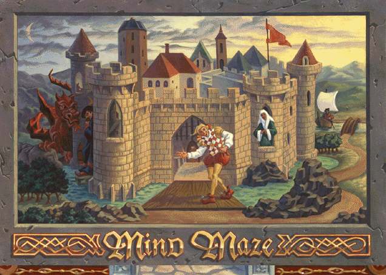

# Port of Encarta MindMaze



```Bash
npm install
npm run build
```

# Existing Deployed App
https://encarta-nostalgia-mindmaze.netlify.app

# Existing Docker Image
```Bash
docker pull tkerrigan/encarta98-mindmaze
docker run --network host tkerrigan/encarta98-mindmaze
```

then, access http://localhost via a browser.
